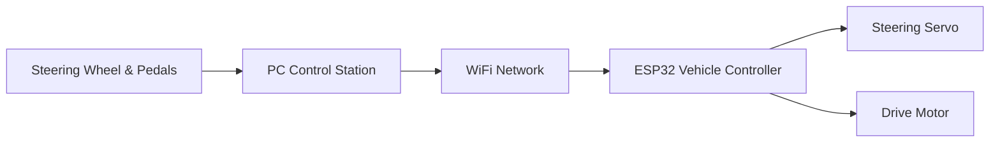
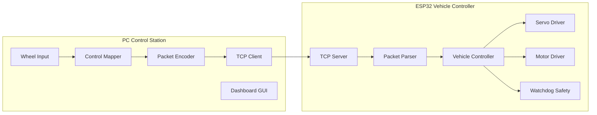
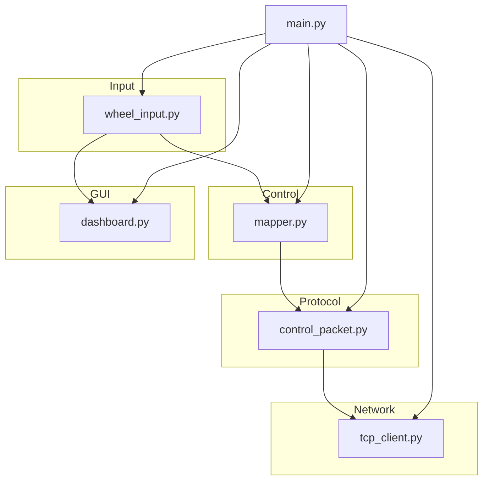
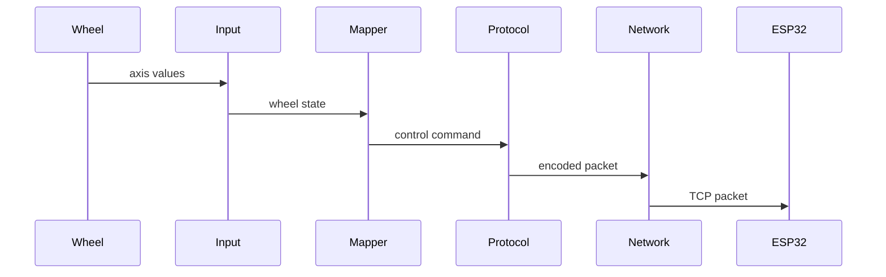
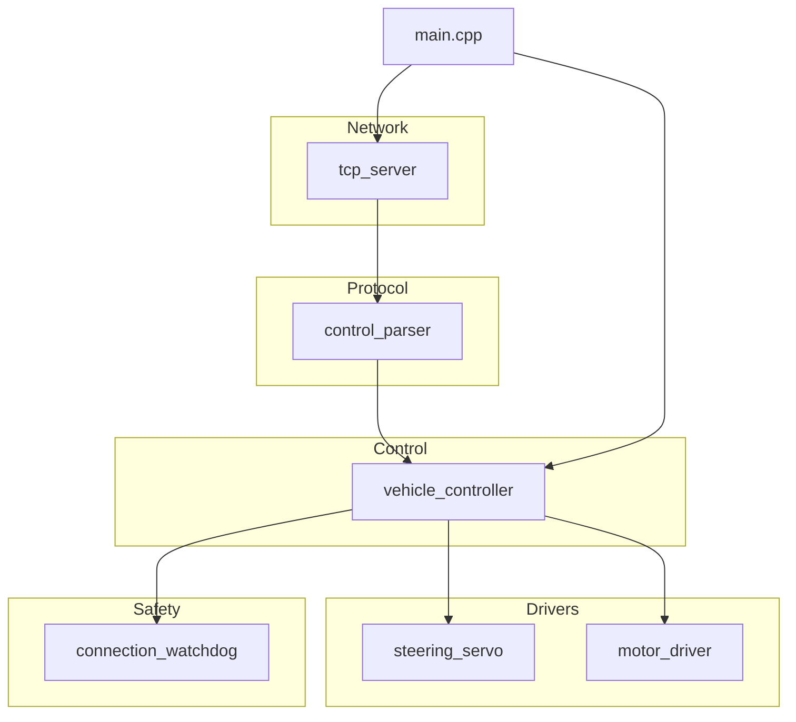
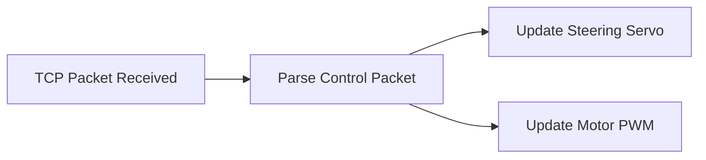
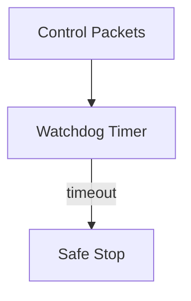
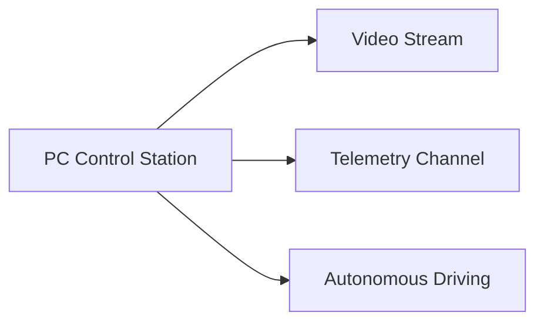
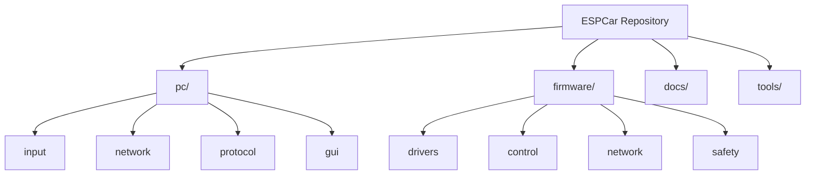

# ESPCar Architecture

## Overview

ESPCar — это система управления RC-автомобилем с использованием игрового руля.
Архитектура разделена на две основные части:

* **PC Control Station** — обработка пользовательского ввода и отправка команд.
* **ESP32 Vehicle Controller** — управление исполнительными механизмами автомобиля.

Связь осуществляется по **TCP через WiFi**.

---

# System Architecture



---

# High-Level Software Architecture



---

# PC Application Architecture



---

# PC Runtime Data Flow



Packet format (v1):

```
steer,throttle,brake\n
```

Example:

```
0.120,0.850,0.000
```

---

# ESP32 Firmware Architecture



---

# ESP32 Control Loop



---

# Safety Mechanism

ESP32 реализует механизм безопасности:

* если **пакеты управления не приходят более 200 ms**
* система автоматически:

```
motor = stop
servo = center
```



---

# Future Extensions

Архитектура проектируется с учётом расширения системы.

Планируемые модули:

* Video Streaming
* Telemetry
* Autonomous Driving
* Recording and Replay
* Force Feedback



---

# Repository Structure



---

# Control Frequency

| Component     | Frequency |
| ------------- | --------- |
| Wheel Input   | ~100 Hz   |
| Network Send  | ~50 Hz    |
| GUI Update    | ~30 FPS   |
| Servo Control | ~50 Hz    |

---

# Design Goals

* Простая отладка
* Чёткое разделение модулей
* Расширяемость
* Безопасность управления
* Минимальная задержка управления

---
