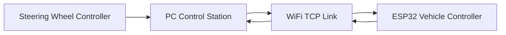
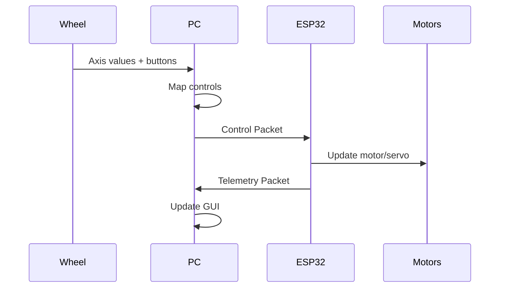
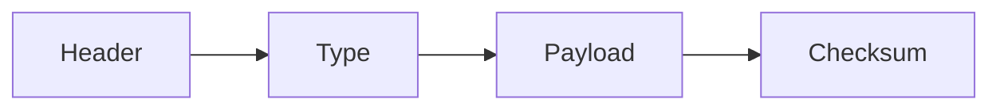
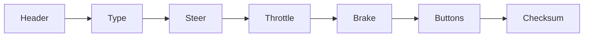
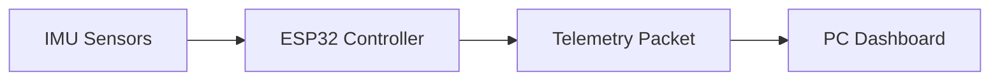
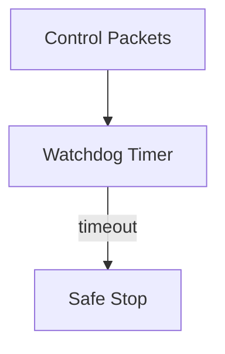

# ESPCar Communication Protocol

## Overview

ESPCar использует **бинарный протокол поверх TCP** для передачи управляющих команд от ПК к ESP32 и получения телеметрии от автомобиля.

Основные цели протокола:

* минимальная задержка управления
* фиксированная длина пакетов
* простота парсинга на ESP32
* расширяемость
* поддержка телеметрии

Протокол разработан по принципам, используемым в системах управления **FPV-дронов и робототехники**.

---

# Communication Architecture



Связь является **двусторонней**:

* ПК → ESP32 — управление
* ESP32 → ПК — телеметрия

---

# Data Flow



---

# Packet Design Principles

Протокол построен по следующим правилам:

### 1. Фиксированная структура

Каждый пакет имеет чёткую структуру:

```text
Header
Packet Type
Payload
Checksum
```

Это позволяет быстро парсить пакеты на ESP32.

---

### 2. Малый размер пакета

Пакеты должны быть:

* компактными
* предсказуемыми
* быстрыми для передачи

Целевой размер управляющего пакета:

```text
10 bytes
```

---

### 3. Простота парсинга

ESP32 должен иметь возможность:

* читать пакет
* проверять checksum
* извлекать значения

без использования строковых операций.

---

### 4. Расширяемость

Каждый пакет имеет поле **Packet Type**, что позволяет добавлять новые типы пакетов без изменения существующих.

---

# Packet Structure

## General Packet Layout



---

# Packet Header

| Byte | Name   | Description       |
| ---- | ------ | ----------------- |
| 0    | Header | Start byte (0xAA) |

Используется для синхронизации потока данных.

---

# Packet Types

| Value | Packet Type          |
| ----- | -------------------- |
| 0x01  | Control Packet       |
| 0x02  | Telemetry Packet     |
| 0x03  | Configuration Packet |
| 0x04  | Heartbeat            |

---

# Control Packet

Пакет управления передается **от ПК к ESP32**.

Частота передачи:

```text
~50 Hz
```

---

## Control Packet Layout

| Byte | Field        | Size |
| ---- | ------------ | ---- |
| 0    | Header       | 1    |
| 1    | Packet Type  | 1    |
| 2    | Steer LSB    | 1    |
| 3    | Steer MSB    | 1    |
| 4    | Throttle LSB | 1    |
| 5    | Throttle MSB | 1    |
| 6    | Brake LSB    | 1    |
| 7    | Brake MSB    | 1    |
| 8    | Buttons      | 1    |
| 9    | Checksum     | 1    |

---

## Control Packet Diagram



---

# Control Values

Все значения кодируются **16-битными целыми числами**.

---

## Steering

Диапазон:

```text
-1000 .. 1000
```

Mapping:

| Value | Steering   |
| ----- | ---------- |
| -1000 | full left  |
| 0     | center     |
| 1000  | full right |

---

## Throttle

Диапазон:

```text
0 .. 1000
```

| Value | Meaning       |
| ----- | ------------- |
| 0     | no throttle   |
| 1000  | full throttle |

---

## Brake

Диапазон:

```text
0 .. 1000
```

| Value | Meaning    |
| ----- | ---------- |
| 0     | no brake   |
| 1000  | full brake |

---

# Buttons Field

Кнопки кодируются **битовой маской**.

| Bit | Button       |
| --- | ------------ |
| 0   | Button A     |
| 1   | Button B     |
| 2   | Button X     |
| 3   | Button Y     |
| 4   | Paddle Left  |
| 5   | Paddle Right |
| 6   | Reserved     |
| 7   | Reserved     |

Пример:

```text
00000101
```

означает:

* Button A
* Button X

---

# Checksum

Checksum вычисляется как:

```text
sum(packet bytes 0..8) mod 256
```

ESP32:

1. считает checksum
2. сравнивает с полученным
3. принимает или отклоняет пакет

---

# Control Packet Example

```text
AA 01
E8 03
F4 01
00 00
02
5F
```

Расшифровка:

* Steer = 1000
* Throttle = 500
* Brake = 0
* Button B pressed

---

# Telemetry Packet

Телеметрия передается **от ESP32 к ПК**.

Частота передачи:

```text
10–20 Hz
```

---

## Telemetry Packet Layout

| Byte | Field       |
| ---- | ----------- |
| 0    | Header      |
| 1    | Packet Type |
| 2    | Gyro X L    |
| 3    | Gyro X H    |
| 4    | Gyro Y L    |
| 5    | Gyro Y H    |
| 6    | Gyro Z L    |
| 7    | Gyro Z H    |
| 8    | Status      |
| 9    | Checksum    |

---

# Telemetry Data

Телеметрия может включать:

* гироскоп
* акселерометр
* напряжение батареи
* скорость
* температура ESP32
* RSSI WiFi

---

## Telemetry Architecture



---

# Safety Mechanism

ESP32 реализует watchdog.

Если пакеты управления не приходят более:

```text
200 ms
```

ESP32 переходит в безопасный режим.

---

## Safety Flow



Safe state:

```text
motor = stop
servo = center
```

---

# Future Extensions

Протокол спроектирован для расширения.

Возможные будущие пакеты:

| Type | Description        |
| ---- | ------------------ |
| 0x05 | Camera control     |
| 0x06 | Autonomous control |
| 0x07 | Log data           |

---

# Protocol Versioning

Версия протокола фиксируется в документации.

Current version:

```text
Protocol v1
```

Изменения протокола должны сопровождаться:

* обновлением документации
* обновлением firmware
* обновлением PC software.

---
